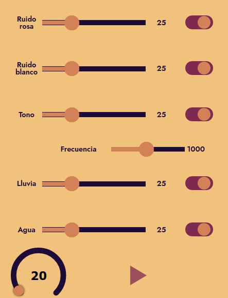

## Estructura del mixer



El sintetizador está diseñado en base a la librería [Tone.js](https://tonejs.github.io/). Se activa y desactiva desde el botón 'Play'. Según el generador los controles pueden variar, cada generador tiene un identificar y un control de volumen.

Para testear el código se recomienda usar el plugin **Live Server** en **VS Code**. Haciendo clic derecho sobre `index.html` y seleccionando **Open with Live Server** abrirá la aplicacón en el navegador.

### HTML
En la plantilla HTML se encuentran los elementos de cada generador de audio. Todos están contenidos dentro de `flex_consola`, usando el modulo [flexbox](https://developer.mozilla.org/es/docs/Web/CSS/CSS_Flexible_Box_Layout/Conceptos_Basicos_de_Flexbox).

### CSS
Se puede customizar la apariencia gráfica de cada objeto en caso de que sea necesario. Para cada generador de audio se hizo un archivo css, pero tienen todos básicamente el mismo contenido.

#### Input range (slider range)
Todo el mixer esta basado en el componente input range. A continuacion algunas referencias para su manejo:

* https://www.youtube.com/watch?v=0hZ2TJWtKgk
* https://www.youtube.com/watch?v=LNkjivRSyd4
* http://danielstern.ca/range.css/#/ 
* https://dev.to/richiksc/standardizing-input-type-range-styling-3lkl
* https://brennaobrien.com/blog/2014/05/style-input-type-range-in-every-browser.html  

> Especial atención al browser utilizado, input es dependiente del mismo.

### JS
En JavaScript, el archivo principal es `mixer_audioMain.js`, éste crea la instancia de nuestro 'audio context':

```js
const AudioContext = window.AudioContext || window.webkitAudioContext;
const audioCtx = new AudioContext();
Tone.context = audioCtx;
```

Luego, se crea el botón `playButton` y se le asignan instrucciones para ejecutar al ser presionado, activando o desactivando la salida de audio.

Todos los componentes de audio están en `mixer_components.js`. Acá se establece la relación entre los controles y los parámetros de audio correspondientes. Por ejemplo:

```js
const volumeControlRain = document.querySelector('[data-action="volume-rain"]');
const onOffSwitchRain = document.querySelector('.switch_rain');

volumeControlRain.addEventListener('input', function() {

    gainNodeRain.gain.value = this.value / 100;
    console.log(this.value / 100);

}, false);

onOffSwitchRain.addEventListener('change', function() {
	
	if (this.dataset.power === 'on') {
		if (playButton.dataset.playing === 'true') {
			noiseRain.stop();
		}
		this.dataset.power = 'off';
	} else if (this.dataset.power === 'off') {
		if (playButton.dataset.playing === 'true') {
			noiseRain.start();
		}
		this.dataset.power = 'on';
	}
	console.log(this.dataset);

    let state = this.getAttribute('aria-checked') === "false" ? true : false;
	this.setAttribute( 'aria-checked', state ? "true" : "false" );
}, false);

```

Este código va a crear los objetos `volumeControlRain` y `onOffSwitchRain` y los va a asociar a los elementos del html a través de la función `querySelector`. Luego definimos listeners para ejecutar las acciones correspondientes a cada control.

### Agregar más módulos

Para crear un nuevo módulo, llamado por ejemplo `mi modulo` haremos lo siguiente:

* Crear, en el html, los controles de volumen y ganancia para el módulo: 

```html
<div class="slider_mi_modulo">
    <div class="label_mi_modulo">Lluvia</div>
    <div class="input_range_mi_modulo">
        <input type="range" min="0" max="100" value="25" step="1" class="slider" id="slider_mi_modulo" data-action="volume-mi_modulo" >
    </div>
    <div class="value_mi_modulo" id="value_mi_modulo">25</div>    

    <button class="switch_mi_modulo" role="switch" aria-checked="true" data-power="on">
        <input type="checkbox" id="switch_mi_modulo" checked="checked"/>
        <label for="switch_mi_modulo">Toggle</label>
    </button>

</div>
```

Definir estas clases en el archivo `mi_modulo.css`:

```css
.slider_mi_modulo {
    background-color: transparent;
    height: 80px;
    width: 90%;
    display: flex;
    margin-left: 5%;
    margin-top: 2%;
    margin-bottom: 2%;
    align-items: center;
}

.slider_mi_modulo .label_mi_modulo {
    background-color: transparent;
    text-align:center;
    width: 15%;
    font: 600 1rem/1rem 'Jost', sans-serif;
    color:#1d0b38;
}

.slider_mi_modulo .input_range_mi_modulo {
    background-color: transparent;
    text-align: center;
    width: 50%;
}

.slider_mi_modulo .value_mi_modulo {
    background-color: transparent;
    text-align: center;
    width: 15%;
    font: 600 1rem/1rem 'Jost', sans-serif;
    color:#1d0b38;
}

.slider_mi_modulo .switch_mi_modulo {
    background-color: transparent;
    border: transparent;
    text-align: center;
    width: 20%;
}
```

Importar el css en el html: `<link rel="stylesheet" href="static/mi_modulo.css">`

Tomar como template el código para un módulo existente y editarlo. Una vez finalizado el archivo `mi_modulo.js`, importarlo en el html con la línea `<script src="js/mi_modulo.js"></script>`


